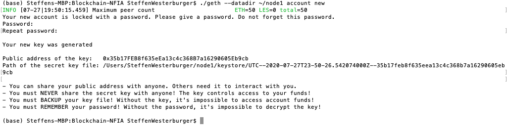
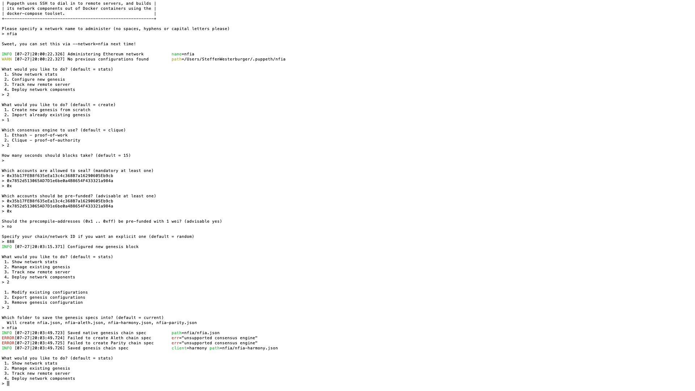
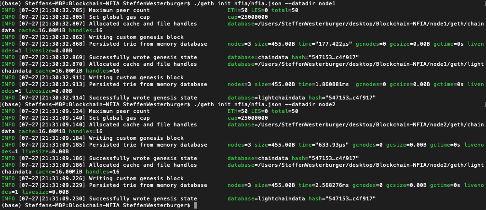
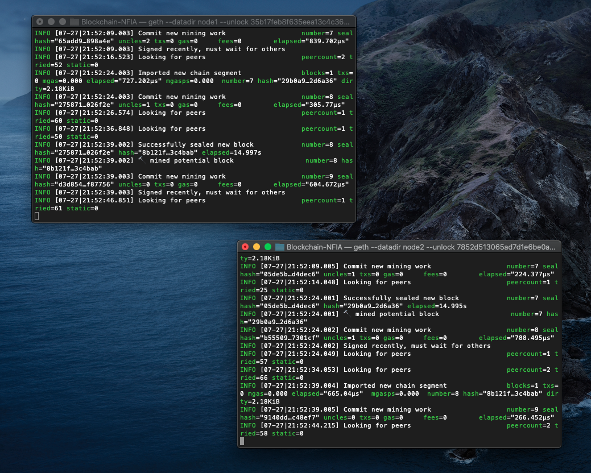
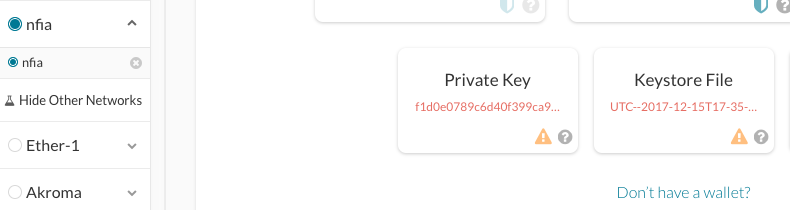
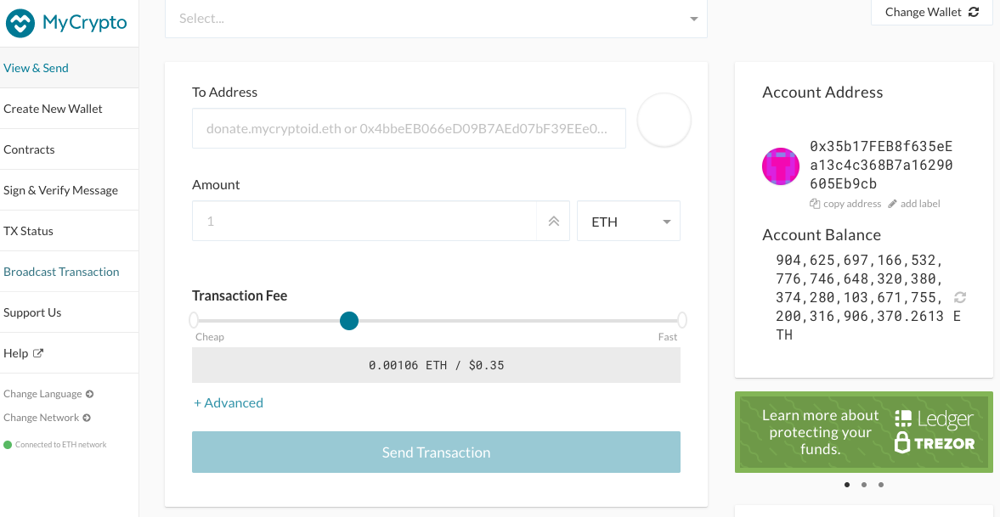
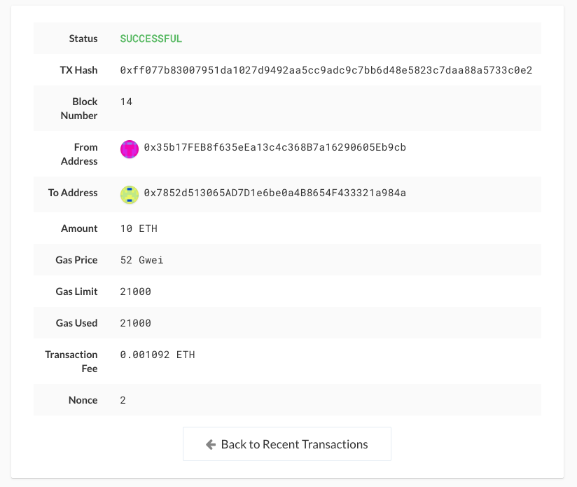
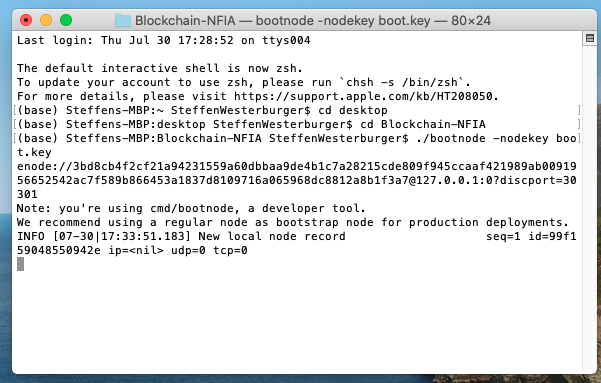
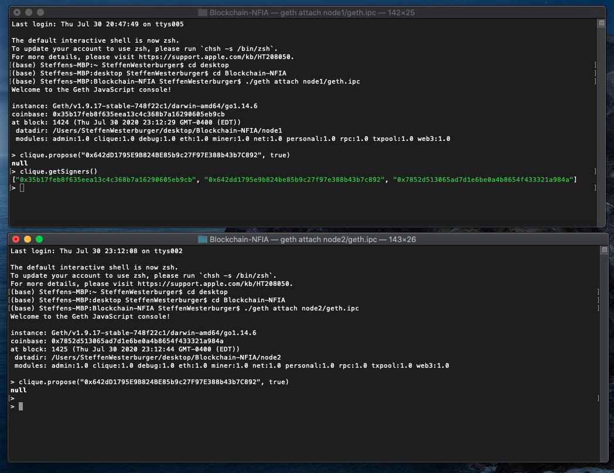

## Blockchain Homework - Steffen Westerburger ##
## Proof of Authority Development Chain ##

**Necessary installs**

* For the creation of our own Proof of Authority Development Chain we will be using 'Go Ethereum' tools. 
* This Development Chain will be used in conjunction with the MyCrypto Desktop app.
* In the real world it is of the greatest importance to **never** share private keys/passwords. Some of the screenshots in this document will however show these keys/passwords. These are just for instructional purposes and will be deleted immediately after. 
* In this readme I will only show the most important screenshots, more screenshots of the process can be found in the screenshots folder 

**The creation of the blockchain network** 

-- **Creating the nodes**

1. Create a folder and unpack the Go Ethereum tools 
2. Make folders for the new nodes ('node1' and 'node2') using the 'mkdir' command in the blockchain folder. 
3. Since we are creating a Proof of Authority Chain, we will have to create a new account for each of the two nodes in our network. We will do this using the following command: ./geth  --datadir ~/node1 account new 

4. A public address of the key (the account) and the path of a secret key (keystore file) will be given. Make sure to save these. We need these later. 
5. The nodes have specific passwords you give in when you create them - dont forget these. 

-- **Creating the Genesis Block**

1. We can now go ahead an create the Genesis Block of our chain. We will use puppeth of our Go Ethereum tools for that. We run the command: ./puppeth
2. Specify the name of the network. I chose 'nfia' 
3. The interface will ask several other questions, for example the algorithm (we choose proof of authority) and what accounts will be 'sealers' (basically miners) in this blockchain
4. Parse in the account numbers of the nodes we created under the 'creating the nodes' paragraph.
5. Make sure we prefund these accounts with virtual coins
6. Specify the chain ID - I chose 888 (remember this - we will need this later)
7. Export the Genesis Block into our folder 

-- **Initializing our nodes**
1. The first time we run our blockhain we need to intialize our nodes. We do this with the .geth init nfia/nfia.json --datadir node 1 (and later node 2) commands

In doing so we basically tell the nodes about the genesis block and configure them accordingly. This initializing step is only to be done once. 

-- **Starting up the Network**

1. Since our first node will also function as our bootnode, we will start up the first node first. We use the following command:

 `./geth --networkid 888 --datadir node1 --unlock "35b17feb8f635eea13c4c368b7a16290605eb9cb" --mine --rpc --allow-insecure-unlock`

As you can see we use the geth commant and specify our chain id (888) and the datadir of the first node. Furthermore we use the unlock command specified toward the account number of our first node (in "") after that we tell the node to start mining. The flag 'rpc' basically opens this node to the network. 

2. To start op de second node (which will be tied to the bootnode) we use the following command:

`./geth --networkid 888 --datadir node2 --unlock "7852d513065ad7d1e6be0a4b8654f433321a984a" --mine --port 30304 --bootnodes enode://0b754f9b80fcd07d3bf381195b4148bd724af5d73321c1384652e4897efbf7be25d121bf0ab0e79e81656a0059db18a7a29dbfbf0d99ced8e77e22f7c88d988b@127.0.0.1:30303 --miner.threads 1`

Here againw e specify the network id and the data direction of the second node. We unlock with the public account number and tell the node to mine. When the first node was started up, we were given and 'enode' address (basically the identifier of the first bootnode, so that node2 can recognize node 1) this enode is parsed in using the bootnodes flag. 

If we do this correctly the nodes will start 'talking to each other' and start mining.

-- **Connecting to MyCrypto**

1. Open the MyCrypto desktop app and navigate to 'change network' on the lower left of the screen
2. Click on 'add custom node' to set up our newely created network 
3. In the box 'Network' select 'Custom' 
4. Give the node a name, specify currency as ETH, file out the chain ID (remember - 888 in our case!) en fill out the URL (in this case the standard http://127.0.0.1:8545)
5. Hit save and you have now added your own network!

6. We can access the wallet by using the keystore file of the first node. Click on keystore file and upload the keystore file in the folder of node 1. Together with node1's password you can now open your wallet. 

7. We can now make transactions between the accounts of our nodes. Simply click on send ether and parse in the account number of node 1. Specify the amount of ETH and hit 'Send Transaction'. The blokchain will now process the transaction. 

-- **Challenge: create a bootnode & add additional sealer on fly**

**Create a new bootnode** 

To create a bootnode for all nodes on the network to connect to we simply use the following command:

`./bootnode -genkey boot.key`
`./bootnode -nodekey boot.key` 

This creates a bootnode key in the blockchain folder and provides us with an 'enode' address (like seen before) that we can use the --bootnodes flag for when starting up both nodes! 

Make sure to save this information and use it when starting up the chain. Both node1 and node2 will now be using this enode of the bootnode to connect to. 

**Add a new sealer on the fly**

As seen, sealers on a proof of authority network are specified when the Genesis Block is created. If we want to add new sealers to the chain after this is done, we need to 'propose' the new sealer to the network and at least 50% of the nodes need to agree. 

1. Create a new node like we did before. Using the same commands we know create node3. We will however not be able to 'seal' this node the same way as node1 and node2.
2. In order to propose the new sealer we need to open the Geth Javascript terminal for both of the nodes in our network:

`./geth attach node1/geth.ipc`
`./geth attach node2/geth.ipc'`

3. we now use the `clique.propose(“0x642dD1795E9B824BE85b9c27F97E388b43b7C892”, true)` with the public address of the new node (node3) to propose the new node as a sealer. 
4. With `clique.getSigners()` we can check if the new sealer is allowed in (so if 50% of the nodes has agreed on it)
5. Succes! Node3 is a sealer!

